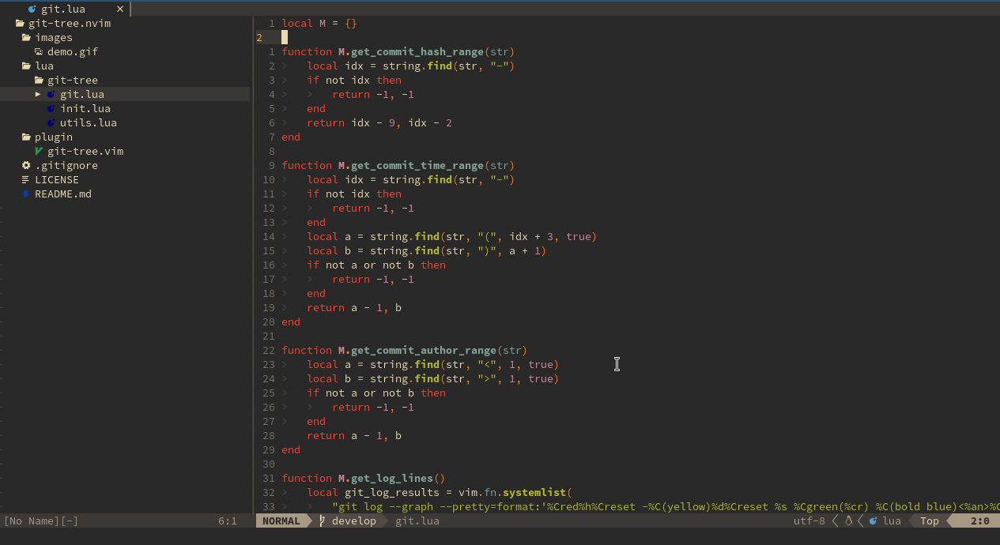

# git-tree.nvim

Git tree plugin to easy visualize git diffs.

## TODO
- [ ] Create Git helper module;
- [ ] Fix coloring for windows ( should be transparent );
- [ ] Add hash/branches/tags highlighting;
- [ ] Add ability to move between windows;
- [ ] Show diff by file;
- [ ] First commit author name doesn't highlights;

